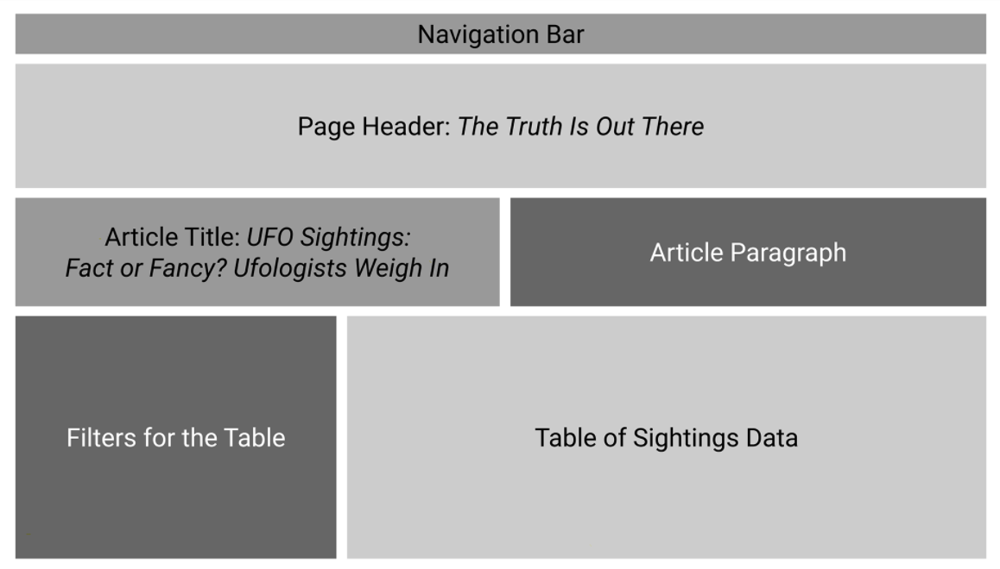

# UFOs
UC Berkeley Extension Data Analytics Boot Camp Module 11

<i> Run the **index.html** file to view the webpage.</i>

---

## Objective:

In this module, we were tasked with designing a webpage that allows a user to view and filter data compiled on various UFO sightings. We used JavaScript, HTML, and CSS to accomplish this. 

Here is the layout we settled on:

We used JavaScript to read the data and create the filters that can be seen on the page. HTML was used to design the webpage layout, and CSS was used to style it, with the help of some Bootstrap elements. 

We decided to use a dark background for the page, and used an image from the NASA website as a background for our page title.

Initially, we had just created a Date filter to view all the results for a particular date. However, we were then tasked with adding additional filters for City, State, Country, and Shape.

One recommendation for improving this webpage would be to clean the data in the "Duration" column. As it stands, there is no standard format for the reporting of UFO sighting duration, and there are typos and inconsistent abbreviations for units of time. By cleaning this data up, we would be able to filter by duration as well. However, in it's current form, the results of such a filter would not provide any useful insights.

